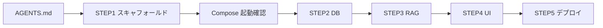

# knowledge-base — エージェント向け仕様

このファイルが **単一の一次ソース**です。以降の実装は「該当 STEP の節だけを開いて実装する」運用とする。

---

## プロジェクト目的と設計思想

- **目的:** 映像表現の根拠となる「論文（理論）」と「オープンデータ（事実）」を集約・解析し、制作工程（Next.js や After Effects 等）で再利用できる構造化データ（JSON 等）へ変換する制作支援インフラとして、エージェントと人が同じ前提で実装できるようにすること。
- **設計思想:**
  - **装飾最小:** UI と説明は必要十分に留める。
  - **前処理の自動化:** 取り込み〜正規化を手作業に頼りすぎない構成を目指す。
  - **再利用可能な JSON 出力:** API 契約とスキーマを明確にし、機械可読な結果を一級市民として扱う。

---

## 技術スタックとモノレポ構成

| 領域 | スタック |
|------|----------|
| フロント | Next.js + TypeScript（App Router 推奨）、パッケージマネージャは **npm**（`package-lock.json`） |
| バックエンド | FastAPI + uvicorn |
| バックエンド（Drizzle のみ） | **pnpm**（`pnpm-lock.yaml`）— Drizzle Studio / `drizzle-kit` 用の Node 依存 |
| データベース | PostgreSQL + pgvector（ローカルは `ankane/pgvector` イメージ） |

### ディレクトリ境界

- `frontend/` — Next.js のみ。バックエンド実装・DB スキーマは **触らない**（API 契約に沿ったクライアント呼び出しのみ）。
- `backend/` — FastAPI・DB アクセス・RAG/LLM ロジック。**Next のページ構成やコンポーネントは触らない**。
- リポジトリ直下 — `docker-compose.yml`、`AGENTS.md` など共有インフラ・資料。

共有するのは **環境変数名・API の入出力契約** に限定し、相手側の設定ファイルを勝手に書き換えない。

---

## 環境変数ポリシー

- **フロント:** ローカル秘密は `frontend/.env.local`。公開してよい値は `NEXT_PUBLIC_*` のみ。
- **バックエンド:** `backend/.env`（Compose では同ファイルを `.env` としてマウントする想定でよい）。
- **テンプレート:** `frontend/.env.example` / `backend/.env.example` をリポジトリに含め、実値は含めない。
- **Git:** `frontend/.gitignore` / `backend/.gitignore`（またはルート統合）で `.env`、`.env.local`、`.venv`、`node_modules` などを必ず除外する。

---

## Docker Compose 仕様

| サービス | ポート | 備考 |
|----------|--------|------|
| `frontend` | 3000 | `NEXT_PUBLIC_API_URL` 等を build/run 時に注入可能にする |
| `backend` | 8000 | `DATABASE_URL` は `.env` から読む。DB 起動待ちは `depends_on` に加え、簡易 wait スクリプトまたは **初回接続リトライ**で吸収する方針でよい |
| `db` | 5432 | `image: ankane/pgvector` |

各パッケージに `.dockerignore` を置き、開発用 Dockerfile は **ボリュームマウント + ホットリロード**（フロント: `npm run dev`、バックエンド: `uvicorn --reload`）を前提とする。

---

## 依存関係のセキュリティ（npm / Python）

**方針:** `npm install` / `pip install` で **新規パッケージを追加する前**に、既知リスクの有無を確認する。追加後もロックファイルベースで監査する。

**高危険度の脆弱性:** 放置せず、更新・代替・例外理由の記録のいずれかで扱う。例外を選ぶ場合は理由を本ファイルまたは PR 説明に残す。

### 新規パッケージを入れる前（双方共通）

- **供給元の確認:** 正しいパッケージ名か（タイポスクワッティング回避）、メンテ状況・星・最近のコミット／リリースを目視。
- **レジストリ情報:** npm ならパッケージページと公開者；PyPI ならプロジェクトリンク・Maintainer を確認。

### npm（`frontend/`）

- **導入前:** パッケージ単体で `npm view <pkg>`（説明・最新版・依存の概要）。必要なら https://github.com/advisories やパッケージの Security タブを確認。
- **導入後:** `package-lock.json` をコミットし、`npm audit` を実行。

### pnpm（`backend/` — Drizzle Studio / drizzle-kit のみ）

- **導入前:** 上記「新規パッケージを入れる前」と同様に npm レジストリ上の供給元を確認（`pnpm view <pkg>` でも可）。
- **導入後:** `pnpm-lock.yaml` をコミットし、`pnpm audit` を実行。コマンドは `backend/` で `pnpm install` / `pnpm run db:studio` 等（`package.json` の `packageManager` を参照）。

### Python（`backend/` FastAPI）

- **導入前:** PyPI／GitHub で既知脆弱性・Issue をざっと確認。実行ファイル系・ネットワーク権限を要するパッケージは依存関係も含め注意。
- **導入後:** 版本固定（`requirements.txt` または `uv.lock` 等）を維持し、可能なら **`pip-audit`**（またはチーム標準の同等ツール）で既知 CVE をスキャン。修正不可能な場合は理由と期限を残す。

### 実装フェーズとの対応

- **STEP 1:** 初期スキャフォールド直後、フロント・バックエンドそれぞれで上記の **audit / pip-audit を 1 回**走らせ、ゼロベースの結果を把握する（CI 化は STEP 5 の任意拡張）。

---

## 1 フェーズずつ進める運用

1. 直前の STEP の **完了定義**を満たしてから次へ進む。
2. 変更は **当該 STEP が触ってよいディレクトリ**に閉じる（上記境界を守る）。
3. STEP 完了時は本ファイルの **ステータス**を更新する（下記「現在のステータス」）。

### 現在のステータス

| STEP | 状態 | メモ |
|------|------|------|
| STEP 1 | 完了 | `docker compose up` 疎通済（`/health`・フロント 200）。npm audit 0 件。pip-audit クリア（`fastapi==0.135.3` で starlette CVE 対応） |
| STEP 2 | 完了 | SQLAlchemy + pgvector。`documents` / `raw_data`。起動時 `CREATE EXTENSION IF NOT EXISTS vector` と `create_all`（Alembic はスキーマ変更が増えた段階で導入） |
| STEP 3 | 未着手 | STEP 2 の DB スキーマに依存 |
| STEP 4 | 未着手 | `/api/analyze` 契約に依存 |
| STEP 5 | 未着手 | デプロイ・本番ビルド |

**STEP 1 完了定義**

- `docker compose up` でフロント・API・DB が起動する。
- ブラウザでフロントが表示される。
- API でヘルスチェックが通る（例: `GET /health` を STEP 1 で最小実装してよい）。
- **STEP 2 着手条件:** 上記を満たし、本表で STEP 1 を「完了」に更新したこと。

**STEP 2 完了定義**

- `DATABASE_URL` で PostgreSQL（pgvector）に接続できる。
- `documents`（`text`, `embedding: vector(1536)`）と `raw_data`（`source`, `content: jsonb`）が定義され、起動時にテーブルが作成される。
- アプリ起動時に `CREATE EXTENSION IF NOT EXISTS vector` が実行される。
- `GET /health` が DB 疎通を含め成功する。
- **STEP 3 着手条件:** 本表で STEP 2 を「完了」に更新したこと。

---

## STEP 定義と実装プロンプト（Cursor / エージェント向け）

> **注:** 別途ユーザーが貼った「Cursor へのプロンプト」本文は本リポジトリに無いため、以下は **初期計画書の要件をそのまま実装指示として転記**したもの。フェーズ着手時は該当 STEP のブロックをコピーして使う。

### STEP 1 — モノレポと Docker 基盤

**定義**

- `frontend/` — `create-next-app` 相当（TypeScript、App Router 推奨）。開発用 Dockerfile（ボリュームマウント + `npm run dev`）。
- `backend/` — FastAPI + uvicorn。開発用 Dockerfile（`--reload`、ソースマウント）。
- リポジトリ直下: `docker-compose.yml`（3 サービス）、各パッケージ用 `.dockerignore`。
- `frontend/.env.example` — `NEXT_PUBLIC_API_URL=http://localhost:8000` 等。
- `backend/.env.example` — `DATABASE_URL=postgresql://...`（ローカル Compose 用のデフォルト）。STEP 2 向け Supabase 用の別名はコメントまたはプレースホルダでよい（実接続は STEP 2）。

**プロンプト（実装用・原文相当）**

```
AGENTS.md の STEP 1 に従い、knowledge-base リポジトリにモノレポと Docker 基盤を実装してください。

- frontend/: Next.js + TypeScript（App Router）、開発用 Dockerfile（ソースボリューム + npm run dev）、.dockerignore、.env.example（NEXT_PUBLIC_API_URL 等）
- backend/: FastAPI + uvicorn、開発用 Dockerfile（--reload、ソースボリューム）、.dockerignore、.env.example（Compose 用 DATABASE_URL。Supabase はプレースホルダのみ）
- ルート: docker-compose.yml で frontend:3000、backend:8000、db:5432（image: ankane/pgvector）。環境変数と depends_on を接続し、DB 待ちは wait またはバックエンドの接続リトライでよい
- .gitignore で .env / .env.local / .venv / node_modules 等を除外
- バックエンドに GET /health のような最小ヘルスエンドポイントを追加してよい
- スキャフォールド直後、frontend で npm audit、backend で pip-audit（または同等）を 1 回実行し結果を把握すること（AGENTS.md の依存関係セキュリティに従う）

計画ファイルは編集しないこと。完了したら AGENTS.md の「現在のステータス」で STEP 1 を完了に更新すること。
```

### STEP 2 — データベースとモデル

**定義**

- SQLAlchemy + PostgreSQL + pgvector。
- モデル: `documents` / `raw_data`。
- 起動時に `CREATE EXTENSION IF NOT EXISTS vector`（SQLAlchemy `event` の on_connect、またはマイグレーション：着手時に Alembic か create_all かを決定）。

**プロンプト（実装用・原文相当）**

```
AGENTS.md と STEP 1 の成果物に従い、STEP 2 を実装してください。

- SQLAlchemy で PostgreSQL（pgvector）に接続
- documents / raw_data モデルを定義
- vector 拡張を CREATE EXTENSION IF NOT EXISTS vector で有効化（接続時イベントまたはマイグレーション）
- Alembic 導入か create_all のみかは本節で決め、一貫した方針で進める

frontend/ は変更しない。backend/ と必要なら docker-compose / .env.example のみ。
```

### STEP 3 — RAG と分析 API

**定義**

- LlamaIndex + Gemini（環境変数 `GOOGLE_API_KEY`）。
- `data/` からの取り込み、pgvector への保存・検索クラス。
- `POST /api/analyze` と、構造化 JSON を強制するプロンプト（スキーマ明示）。

**プロンプト（実装用・原文相当）**

```
AGENTS.md と STEP 2 の DB スキーマに従い、STEP 3 を実装してください。

- LlamaIndex + Gemini（GOOGLE_API_KEY）、公式推奨に合わせてモデル名と SDK をピン止め
- data/ 取り込み、pgvector 保存・検索
- POST /api/analyze を実装し、応答は契約どおりの構造化 JSON になるようプロンプトでスキーマを強制

STEP 2 のテーブル設計を破壊的に変える場合は理由と移行方針を残す。
```

### STEP 4 — フロント UI

**定義**

- アップロード、質問、結果表示。
- JSON ダウンロード、数値の簡易テーブル（shadcn/ui またはプレーン Tailwind）。

**プロンプト（実装用・原文相当）**

```
AGENTS.md と POST /api/analyze の契約に従い、STEP 4 を Next.js で実装してください。

- ファイルアップロード、質問入力、結果の表示
- 結果 JSON のダウンロード
- 数値は簡易テーブル表示（shadcn/ui または Tailwind のみ）

backend/ の契約を変える場合は AGENTS.md の API 節を更新し、互換性に注意する。
```

### STEP 5 — 本番・デプロイ

**定義**

- `PORT` 環境変数対応。
- バックエンド本番用の軽量 Dockerfile。
- `frontend/lib/apiClient.ts`（または既存のクライアント層）で API URL を環境に応じて切り替え。
- `.github/workflows/deploy.yml` の Cloud Run 向け雛形。
- 依存監査の CI 化は任意。

**プロンプト（実装用・原文相当）**

```
AGENTS.md に従い、STEP 5 を実装してください。

- バックエンドを PORT 環境変数に対応させ、本番用の最適化 Dockerfile を用意
- フロントは apiClient 等で API ベース URL を本番/開発で切り替え
- .github/workflows/deploy.yml に Cloud Run デプロイの雛形を追加（秘密値は GitHub Secrets 想定でプレースホルダ）
- 任意: npm audit / pip-audit を CI に組み込む

完了後、AGENTS.md のステータス表を更新する。
```

---

## 依存関係の注意（STEP 間）

- STEP 3 は STEP 2 の DB スキーマに依存する。
- STEP 4 は `/api/analyze` の契約に依存する。

---

## STEP 1 時点で固定しなくてよい決定事項

- **DB マイグレーション:** STEP 2 で Alembic か `create_all` かを決める。
- **Gemini モデル名・SDK:** STEP 3 で LlamaIndex の公式推奨に合わせてピン止めする。

---

## 推奨作業順（参照）


